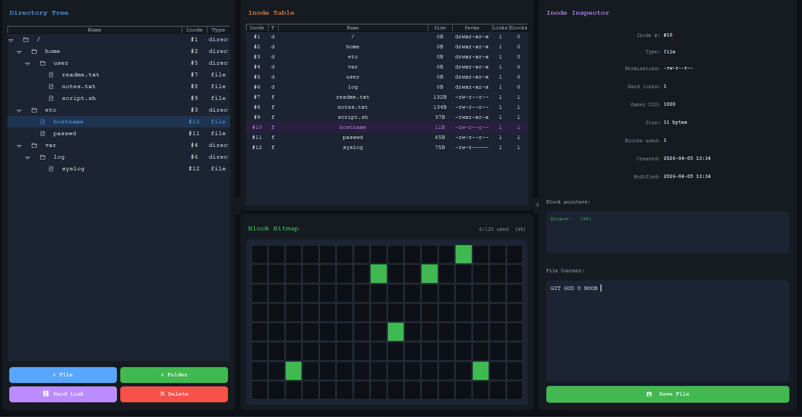

# ext2 Filesystem Emulator

An interactive emulator of a Linux ext2-style inode filesystem, built as an OS course project.

## What it does
Simulates how Linux organizes files on disk using the inode model.
Every action — creating files, editing content, deleting — reflects in real time across all panels.

## Concepts covered
- **Inodes** — every file and folder has an inode storing its metadata
- **Directory entries** — filenames are just pointers to inode numbers
- **Block bitmap** — tracks which disk blocks are free or allocated
- **Direct & indirect block pointers** — how inodes reference data on disk
- **Hard links** — multiple names pointing to the same inode
- **Permissions & timestamps** — just like real Linux

## How to run
— download `ext2-Emulator.exe` from the `dist` folder and run it directly.

## Built with
- Python
- CustomTkinter

---
*OS Course Project — by Nero*
